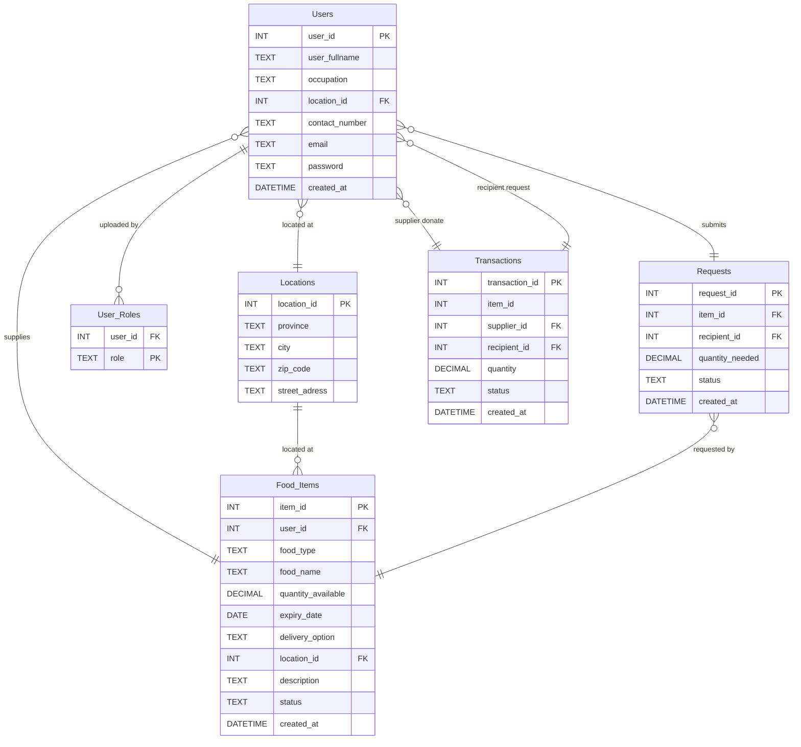

# Group-7_FoodConnect-
FoodConnect is a community driven web platform designed to minimize food waste and promote social impact by connecting suppliers with surplus food to recipients in need, such as shelters, community kitchens, and NGOs. The system enables suppliers to upload details of their available surplus food, while recipients can browse available food surplus listings and submit requests.

## Group 7 Members
| **Name**         | **Student Number** |
|------------------|--------------------|
| Lané Smit        | **22820737**       |
| Cassidy Thersby  | **22591622**       |
| Carin de Beer    | **23757508**       |

## Project Purpose

The purpose of FoodConnect is to address the inefficiencies in South Africa's food supply chain, particularly in the retail and agricultural sectors where food surplus is wasted while underserved communities face food insecurity.

The digital platform connects food suppliers (farmers, shops, bakeries, and restaurants) with recipient organisations (underprivileged schools, shelters, and non-governmental organisations). FoodConnect aims to improve inventory management and customer fulfilment by providing real-time visibility of surplus stock and streamlined communication between suppliers and recipients.

### Impact Areas:
- **Social:** Improves access to food in underserved communities by improving redistribution and reducing food insecurity
- **Economic:** Reduces waste disposal costs for suppliers
- **Environmental:** Less food waste means fewer resources needed for food production

FoodConnect creates a more connected and sustainable food supply chain, enabling businesses to operate more efficiently while having a positive social impact for South Africa.

---

## Features

### Public Pages
- **Main Landing Page (index.html)**: Shows FoodConnect's community impact, testimonials, and how the platform works
- **About Us (about.html)**: Information about FoodConnect's mission and vision
- **Contact (contact.html)**: Contact information for the development team

### Authentication & Authorization
- **User Signup**: Create new accounts with email validation
- **Dual Login System**:
  - Supplier Login (supplierlogin.html)
  - Recipient Login (recipientlogin.html)
- **Role-Based Access Control**: Different features for suppliers vs recipients
- **Session Management**: Secure user sessions with logout functionality

### Supplier Features
- **Supplier Dashboard (supplier-dashboard.html)**:
  - Impact Overview KPIs (total items uploaded, recipients helped, kg donated)
  - Current Inventory display with expiry tracking
  - Items expiring soon alerts
  - Active requests tracking
  - Monthly contribution progress bar
- **Upload Food Surplus (uploadfoodsurplus.html)**: Add new surplus food items
- **View Recipient Needs (view-recipient-needs.html)**: Browse food requests from recipients

### Recipient Features
- **Recipient Dashboard (recipient-dashboard.html)**:
  - Impact KPIs (requests uploaded, suppliers connected, kg received)
  - Community progress tracking
- **View Available Surplus (view-available-surplus.html)**: Browse all available food items with search functionality
- **Upload Request (uploadrequest.html)**: Submit food requests with urgency levels

### Backend Features
- **16 Flask Routes**: Complete backend API
- **3 JSON API Endpoints**:
  - `/api/food-items` - All available food items
  - `/api/requests` - All recipient requests
  - `/api/kpi/supplier` & `/api/kpi/recipient` - Dashboard KPI data
- **Real-time KPI Calculations**: Dynamic metrics for both user types
- **Database CRUD Operations**: Full create, read, update, delete functionality

---

## Database Setup
Follow these steps to create and load the FoodConnect database.
### Using SQLite Command Line
1. Open command prompt and navigate to the project folder.

2. Delete any existing database. If a previous version exists, delete it to avoid conflicts using:
   ```bash
    del foodconnect.db
   ```
3. Create and load the database. Start SQLite using:
   ```bash
   sqlite3 foodconnect.db
   ```
   Once inside the SQLite prompt (sqlite>), load the SQL schema using:
   ```bash
   .read foodconnect.sql
   ```
   
4. Verify the tables to confirm the tables were created using:
   ```bash
   .tables
   ```
   Expected output: food_items locations requests transactions user_roles users
   
5. Check the mock data. Run this command to verify that sample data was inserted successfully using:
   ```bash
   SELECT * FROM users
   ```
   You should see sample records like: Alice Smith | Bob Johnson | Carol White | David Brown
   
6. Exit SQLite when finished, type:
   ```bash
   .exit
   ```

## Database Schema

### Entity Relationship Diagram (ERD)



The database includes the following tables:

### Tables
1. **Users**: Includes user information such as name, occupation, contact number, email and password.
2. **User_Roles**: Contains user id and role of user, either being a supplier or recipient.
3. **Requests**: Includes information such as the request, recipient, quantity and status of the transaction. 
4. **Food_Items**: Available food product type, description, quantity with supplier name, location and contact information.
5. **Transactions**: Transactional information including quantity and status of the request. 
6. **Location**: Includes location information such as province, city, zip code and street code. 


## Database Demonstration
The foodconnect.sql migration file was executed successfully in SQLite to create and populate the foodconnect.db database.
It includes four normalized tables (suppliers, recipients, food_surplus, and food_requests) linked by foreign keys.
Sample data was inserted into each table (5 records per table) to demonstrate supplier-to-recipient food supply chain interactions.
The successful execution was verified using SELECT COUNT(*) queries, confirming that all tables contain sample data.


## Sample Data
The database includes the following data types:

- **2 Users** : Suppliers and Recipients
- **6 Occupation Types** : Restaurant, Grocery Store, Farm, Bakery, Manufacturer, Other
- **8 Food Types** : Vegetables, Fruit, Meat, Dairy, Starch, Bakery, Beverages, Other
- **4 Unit Types** : kg, litres, boxes, items

Other data on the **Supplier dashboard** includes:
- An Impact Overview showing the number of surplus items uploaded, recipients helped, and the amount (in kg) of food donated.
- A Current Inventory display 
- An Order management display showing orders with their order numbers and status.
- Supply chain analytics such as order fulfilment rate and a monthly distribution trend. 

Other data on the **Recipient dashboard** includes the number of requests uploaded, recipients supported, and the total amount (in kg) of food received. 


## File Structure
```
BFB Supply Chain/
|
├── templates/
|   ├── images/
|   |   └──background.png
|   |
|   ├── about.html                       # About us information page
|   ├── contact.html                     # Contact information of the FoodConnect development team
|   ├── index.html                       # Main dashboard
|   ├── recipient-dashboard.html         # Main recipient dashboard
|   ├── recipientlogin.html              # Recipient login page
|   ├── signup.html                      # Sign up page
|   ├── supplier-dashboard.html          # Main supplier dashboard
|   ├── supplierlogin.html               # Recipient login page
|   ├── uploadfoodsurplus.html           # Upload available surplus food
|   ├── uploadrequest.html               # Request surplus food
|   ├── view-available-surplus.html      # View available surplus inventory
|   ├── view-recipient-needs.html        # View recipient food needs
├── foodconnect.db
├── foodconnect.sql
├── README.md                             # Explanation of project purpose, database schema and ERD.
```

## Usage
1. Initialize the database using the SQLite command line method above.
2. Open `index.html` in your web browser.
3. Log into the website as either a supplier or recipient to access the respective dashboards.
4. Navigate through the different pages to request or upload available surplus food.


## Technologies Used
- **Visual Studio Code**: Visual Studios was used to create html files to generate the frontend, and to integrate the sql database. 
- **HTML5**: Used to create the structure of the website. 
- **Bootstrap 5.3.8**: Used to create the user interface (UI) framework and styling
- **Bootstrap Icons**: Icon set was used in the design of our html files. 
- **SQLite**: Used to create the data base and draw up the ERDs.


## Browser Compatibility
The application works with all modern browsers that support HTML5 and CSS3, including:
- Chrome 90+
- Firefox 88+
- Safari 14+
- Edge 90+
