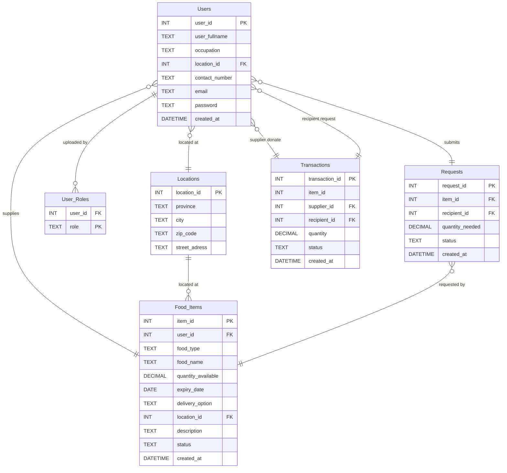

# Group-7_FoodConnect

FoodConnect is a community-driven web platform designed to minimize food waste and promote social impact by connecting suppliers with surplus food to recipients in need, such as shelters, community kitchens, and NGOs. The system enables suppliers to upload details of their available surplus, and recipients can browse available food surplus listings and submit requests.

## Group 7 Members
| **Name**         | **Student Number** |
|------------------|--------------------|
| Lané Smit        | u22820737          |
| Cassidy Thersby  | u22591622          |
| Carin de Beer    | 23757508           |

## Team Contributions

### Lané Smit (u22820737)
- Uploaded initial Flask application (app.py)
- Updated homepage navigation to use Flask routing (index.html)
- Updated About Page navigation to use Flask routing (about.html)
- Updated Contact page navigation (contact.html)
- Implemented supplier pages: dashboard, upload surplus, view needs (supplier-dashboard.html, uploadfoodsurplus.html, view-recipient-needs.html)
- Moved images to static folder and updated templates + Flask app configuration
- Fixed supplier & recipient display and connected UI with database data (app.py, view-available-surplus.html, view-recipient-needs.html)

### Cassidy Thersby (u22591622)
- Integrated signup template with Flask backend and flash messages (signup.html)
- Integrated supplier login page with Flask authentication (supplierlogin.html)
- Updated Recipient Login template to integrate with Flask backend (recipientlogin.html)
- Added full recipient workflow pages for dashboard, requests and surplus browsing (recipient-dashboard.html, view-available-surplus.html, uploadrequest.html)
- Added two new API endpoints in app.py

### Carin de Beer (23757508)
- Added test_routes.py for Flask testing
- Added .gitignore to ignore database, cache and nested repo folder
- Added extended mock data for suppliers, recipients, requests and surplus (foodconnect.sql)

## Project Purpose
The purpose of FoodConnect is to address the inefficiencies in South Africa's food supply chain, particularly in the retail and agricultural sectors where food surplus is wasted while underserved communities face food insecurity. The digital platform is built using Flask (Python web framework) and SQLite database to connect food suppliers including farmers, shops, bakeries, and restaurants with recipient organisations such as underprivileged schools, shelters and non-governmental organisations. 
FoodConnect aims to improve inventory management and customer fulfilment by providing real-time visibility of surplus stock and streamlined communication between suppliers and recipients. This reduces the need for manual processes such as phone calls and emails, ensuring surplus food reaches those in need efficiently. 
The platform contributes to a social, economic and environmental sustainability for South Africa. Socially, it improves access to food in the underserved communities by improving redistribution. To reduce food insecurity. Economically, it reduces waste disposal costs for suppliers. Environmentally, less food is wasted therefore less resources are needed to produce more food. 
FoodConnect aims to create a more connected and sustainable food supply chain. With the use of technology, businesses are given the platform to operate more efficiently and in a more sustainable manner, having a positive social impact for South Africa. Through FoodConnect, surplus food is used as a resource instead of becoming waste. 


## Features

### Authentication & User Management
- **User Registration**: New users can create accounts with email and password
- **Role-Based Login**: Separate login pages for suppliers and recipients
- **Session Management**: Secure session handling with Flask sessions
- **Role Assignment**: Automatic role assignment upon login (Supplier/Recipient)

### Supplier Features
- **Supplier Dashboard**: View comprehensive KPIs including:
  - Total surplus items uploaded
  - Items expiring soon (within 7 days)
  - Number of recipients helped
  - Total kg of food donated
  - Active requests from recipients
- **Upload Food Surplus**: Add new surplus food items with details:
  - Food type and name
  - Quantity available
  - Expiry date
  - Delivery options (Pickup/Delivery)
  - Location and description
- **View Recipient Needs**: Browse all recipient requests with contact information

### Recipient Features
- **Recipient Dashboard**: View impact statistics including:
  - Number of requests submitted
  - Total kg of food received
  - Suppliers supported
- **Browse Available Surplus**: View all available food items with:
  - Supplier information
  - Food details and expiry dates
  - Location and contact information
- **Submit Food Requests**: Request specific quantities of available food items
- **Request Tracking**: Monitor status of submitted requests

### Database Features
- **Normalized Database Schema**: Efficient data storage with foreign key relationships
- **Data Validation**: Triggers to ensure data integrity
- **Mock Data**: Pre-populated sample data for testing and demonstration
- **Transaction Tracking**: Complete audit trail of food donations


## Database Setup
Follow these steps to create and load the FoodConnect database.

### Using SQLite Command Line
1. Open command prompt and navigate to the BFB_Supplychain folder:
   ```bash
   cd Group-7_FoodConnect-/BFB_Supplychain
   ```

2. Delete any existing database. If a previous version exists, delete it to avoid conflicts using:
   ```bash
    del foodconnect.db
   ```
3. Create and load the database. Start SQLite using:
   ```bash
   sqlite3 foodconnect.db
   ```
   Once inside the SQLite prompt (sqlite>), load the SQL schema using:
   ```bash
   .read foodconnect.sql
   ```
   
4. Verify the tables to confirm the tables were created using:
   ```bash
   .tables
   ```
   Expected output: food_items locations requests transactions user_roles users
   
5. Check the mock data. Run this command to verify that sample data was inserted successfully using:
   ```bash
   SELECT * FROM users
   ```
   You should see sample records like: Alice Smith | Bob Johnson | Carol White | David Brown
   
6. Exit SQLite when finished, type:
   ```bash
   .exit
   ```

## Database Schema

### Entity Relationship Diagram (ERD)



The database includes the following tables:

### Tables
1. **Users**: Includes user information such as name, occupation, contact number, email and password.
2. **User_Roles**: Contains user id and role of user, either being a supplier or recipient.
3. **Requests**: Includes information such as the request, recipient, quantity and status of the transaction. 
4. **Food_Items**: Available food product type, description, quantity with supplier name, location and contact information.
5. **Transactions**: Transactional information including quantity and status of the request. 
6. **Location**: Includes location information such as province, city, zip code and street code. 


## Database Demonstration
The foodconnect.sql migration file was executed successfully in SQLite to create and populate the foodconnect.db database.
It includes four normalized tables (suppliers, recipients, food_surplus, and food_requests) linked by foreign keys.
Sample data was inserted into each table (5 records per table) to demonstrate supplier-to-recipient food supply chain interactions.
The successful execution was verified using SELECT COUNT(*) queries, confirming that all tables contain sample data.


## Sample Data
The database includes the following data types:

- **2 Users** : Suppliers and Recipients
- **6 Occupation Types** : Restaurant, Grocery Store, Farm, Bakery, Manufacturer, Other
- **8 Food Types** : Vegetables, Fruit, Meat, Dairy, Starch, Bakery, Beverages, Other
- **4 Unit Types** : kg, litres, boxes, items

Other data on the **Supplier dashboard** includes:
- An Impact Overview showing the number of surplus items uploaded, recipients helped, and the amount (in kg) of food donated.
- A Current Inventory display 
- An Order management display showing orders with their order numbers and status.
- Supply chain analytics such as order fulfilment rate and a monthly distribution trend. 

Other data on the **Recipient dashboard** includes the number of requests uploaded, recipients supported, and the total amount (in kg) of food received. 


## File Structure
```
Group-7_FoodConnect-/
|
├── BFB_Supplychain/
|   ├── static/
|   |   └── images/
|   |       └── background.png           # Background image for website
|   |
|   ├── templates/
|   |   ├── about.html                   # About us information page
|   |   ├── contact.html                 # Contact information page
|   |   ├── index.html                   # Main landing page
|   |   ├── recipient-dashboard.html     # Recipient dashboard
|   |   ├── recipientlogin.html          # Recipient login page
|   |   ├── signup.html                  # User registration page
|   |   ├── supplier-dashboard.html      # Supplier dashboard
|   |   ├── supplierlogin.html           # Supplier login page
|   |   ├── uploadfoodsurplus.html       # Upload surplus food form
|   |   ├── uploadrequest.html           # Submit food request form
|   |   ├── view-available-surplus.html  # Browse available food items
|   |   └── view-recipient-needs.html    # View recipient requests
|   |
|   ├── app.py                           # Main Flask application
|   ├── foodconnect.db                   # SQLite database file
|   ├── foodconnect.sql                  # Database schema and mock data
|   └── test_routes.py                   # Flask route testing
|
└── README.md                            # Project documentation
```

## Installation and Setup

### Prerequisites
- Python 3.x installed on your system
- SQLite3 (usually comes with Python)
- pip (Python package installer)

### Installation Steps

1. **Clone the repository or navigate to the project directory**:
   ```bash
   cd Group-7_FoodConnect-/BFB_Supplychain
   ```

2. **Install Flask**:
   ```bash
   pip install flask
   ```

3. **Initialize the database**:
   Follow the "Database Setup" instructions above to create and populate the database using the SQLite command line (sqlite3 foodconnect.db < foodconnect.sql)

4. **Run the Flask application**:
   ```bash
   python app.py
   ```

5. **Access the application**:
   Open your web browser and navigate to:
   ```
   http://127.0.0.1:5000
   ```

## Usage

1. **Create an Account**: Navigate to the signup page and create a new user account.

2. **Login as Supplier**:
   - Go to the Supplier Login page
   - Use your credentials to log in
   - Access the supplier dashboard to:
     - View inventory and statistics
     - Upload surplus food items
     - View recipient requests

3. **Login as Recipient**:
   - Go to the Recipient Login page
   - Use your credentials to log in
   - Access the recipient dashboard to:
     - View available food surplus
     - Submit food requests
     - Track your requests

### Test Accounts
You can use the following pre-populated accounts from the mock data:
- **Email**: alice@example.com | **Password**: hashed_password_1
- **Email**: bob@example.com | **Password**: hashed_password_2
- **Email**: carol@example.com | **Password**: hashed_password_3

## Flask Routes

### Public Routes
- `GET /` - Homepage/landing page
- `GET /about` - About FoodConnect page
- `GET /contact` - Contact information page
- `GET/POST /signup` - User registration
- `GET/POST /supplierlogin` - Supplier login
- `GET/POST /recipientlogin` - Recipient login
- `GET /logout` - Logout current user

### Supplier Routes (Authentication Required)
- `GET /supplier-dashboard` - View supplier dashboard with KPIs and inventory
- `GET/POST /uploadfoodsurplus` - Upload new surplus food items
- `GET /view-recipient-needs` - View all recipient requests

### Recipient Routes (Authentication Required)
- `GET /recipient-dashboard` - View recipient dashboard with statistics
- `GET /view-available-surplus` - Browse available food surplus
- `GET/POST /uploadrequest` - Submit food request

### API Endpoints (JSON)
- `GET /api/food-items` - Get all available food items
- `GET /api/requests` - Get all requests
- `GET /api/kpi/<user_type>` - Get KPI data for supplier or recipient
- `POST /api/food-items/create` - Create new food item (Supplier only)
- `PUT/POST /api/requests/update/<request_id>` - Update request status

## Technologies Used
- **Python 3.x**: Backend programming language
- **Flask**: Lightweight web framework for Python used to build the backend
- **SQLite**: Relational database used to store users, food items, requests, and transactions
- **HTML5**: Used to create the structure of the website templates
- **Bootstrap 5.3.8**: UI framework and styling for responsive design
- **Bootstrap Icons**: Icon set used in the design of HTML templates
- **Visual Studio Code**: IDE used for development


## Browser Compatibility
The application works with all modern browsers that support HTML5 and CSS3, including:
- Chrome 90+
- Firefox 88+
- Safari 14+
- Edge 90+
