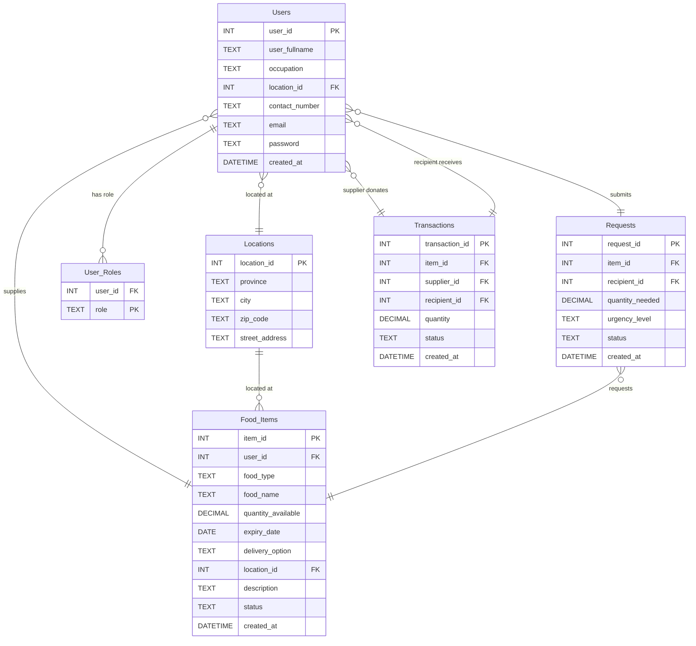

# Group-7_FoodConnect-
FoodConnect is a community driven web platform designed to minimize food waste and promote social impact by connecting suppliers with surplus food to recipients in need, such as shelters, community kitchens, and NGOs. The system enables suppliers to upload details of their available surplus food, while recipients can browse available food surplus listings and submit requests.

## Group 7 Members
| **Name**         | **Student Number** |
|------------------|--------------------|
| Lané Smit        | **22820737**       |
| Cassidy Thersby  | **22591622**       |
| Carin de Beer    | **23757508**       |

## Project Purpose

The purpose of FoodConnect is to address the inefficiencies in South Africa's food supply chain, particularly in the retail and agricultural sectors where food surplus is wasted while underserved communities face food insecurity.

The digital platform connects food suppliers (farmers, shops, bakeries, and restaurants) with recipient organisations (underprivileged schools, shelters, and non-governmental organisations). FoodConnect aims to improve inventory management and customer fulfilment by providing real-time visibility of surplus stock and streamlined communication between suppliers and recipients.

### Impact Areas:
- **Social:** Improves access to food in underserved communities by improving redistribution and reducing food insecurity
- **Economic:** Reduces waste disposal costs for suppliers
- **Environmental:** Less food waste means fewer resources needed for food production

FoodConnect creates a more connected and sustainable food supply chain, enabling businesses to operate more efficiently while having a positive social impact for South Africa.

---

## Features

### Public Pages
- **Main Landing Page (index.html)**: Shows FoodConnect's community impact, testimonials, and how the platform works
- **About Us (about.html)**: Information about FoodConnect's mission and vision
- **Contact (contact.html)**: Contact information for the development team

### Authentication & Authorization
- **User Signup**: Create new accounts with email validation
- **Dual Login System**:
  - Supplier Login (supplierlogin.html)
  - Recipient Login (recipientlogin.html)
- **Role-Based Access Control**: Different features for suppliers vs recipients
- **Session Management**: Secure user sessions with logout functionality

### Supplier Features
- **Supplier Dashboard (supplier-dashboard.html)**:
  - Impact Overview KPIs (total items uploaded, recipients helped, kg donated)
  - Current Inventory display with expiry tracking
  - Items expiring soon alerts
  - Active requests tracking
  - Monthly contribution progress bar
- **Upload Food Surplus (uploadfoodsurplus.html)**: Add new surplus food items
- **View Recipient Needs (view-recipient-needs.html)**: Browse food requests from recipients

### Recipient Features
- **Recipient Dashboard (recipient-dashboard.html)**:
  - Impact KPIs (requests uploaded, suppliers connected, kg received)
  - Community progress tracking
- **View Available Surplus (view-available-surplus.html)**: Browse all available food items with search functionality
- **Upload Request (uploadrequest.html)**: Submit food requests with urgency levels

### Backend Features
- **16 Flask Routes**: Complete backend API
- **3 JSON API Endpoints**:
  - `/api/food-items` - All available food items
  - `/api/requests` - All recipient requests
  - `/api/kpi/supplier` & `/api/kpi/recipient` - Dashboard KPI data
- **Real-time KPI Calculations**: Dynamic metrics for both user types
- **Database CRUD Operations**: Full create, read, update, delete functionality

---

## Technologies Used

### Backend
- **Python 3.x**: Core programming language
- **Flask 2.x**: Web framework for backend
- **SQLite3**: Database management system
- **Jinja2**: Template engine (integrated with Flask)

### Frontend
- **HTML5**: Webpage structure
- **CSS3**: Custom styling
- **Bootstrap 5.3**: UI framework and responsive design
- **Font Awesome 6.4**: Icon library
- **JavaScript**: Client-side interactivity

### Development Tools
- **Visual Studio Code**: Primary development environment
- **Git**: Version control

---

## Installation & Setup

### Prerequisites
- Python 3.7 or higher
- pip (Python package installer)

### Step 1: Install Required Packages

Navigate to the project directory and install Flask:

```bash
pip install flask
```
### Step 2: Database Setup

The database (`foodconnect.db`) is already included with sample data. If you need to recreate it:

#### Using SQLite Command Line:

1. Delete existing database (if needed):
   ```bash
   del foodconnect.db
   ```

2. Create and load the database:
   ```bash
   sqlite3 foodconnect.db
   ```

3. Inside SQLite prompt, load the schema:
   ```sql
   .read foodconnect.sql
   ```

4. Verify tables were created:
   ```sql
   .tables
   ```
   Expected output: `food_items  locations  requests  transactions  user_roles  users`

5. Check sample data:
   ```sql
   SELECT * FROM users;
   ```

6. Exit SQLite:
   ```sql
   .exit
   ```

---

## Running the Application

### Step 1: Start the Flask Server

Open Command Prompt (Windows) or Terminal (Mac/Linux) and navigate to the project folder:

```bash
cd "C:\Users\User\Documents\Group-7_FoodConnect-\Group-27_FoodConnect-\BFB_Supplychain"
```

Start the Flask application:

```bash
python app.py
```

You should see:
```
 * Serving Flask app "app"
 * Running on http://127.0.0.1:5000
```

**Important:** Keep this terminal window open while using the application.

### Step 2: Access the Website

Open your web browser and go to:
```
http://127.0.0.1:5000
```

### Step 3: Stop the Server

When finished, press `Ctrl + C` in the terminal to stop the Flask server.

---

## Usage Guide

### For New Users

1. **Sign Up**:
   - Click "Sign Up Now" on the home page
   - Fill in your details (name, email, phone, password)
   - Create your account

2. **Login**:
   - Choose "Supplier Login" or "Recipient Login"
   - Enter your email and password
   - You'll be redirected to your dashboard

### Test Credentials

The database includes sample accounts for testing:

**Supplier Accounts:**
| Email | Password | Name |
|-------|----------|------|
| alice@example.com | hashed_password_1 | Alice Smith |
| bob@example.com | hashed_password_2 | Bob Johnson |

**Recipient Accounts:**
| Email | Password | Name |
|-------|----------|------|
| carol@example.com | hashed_password_3 | Carol White |
| dave@example.com | hashed_password_4 | Dave Brown |

### As a Supplier

1. **Login** using supplier credentials
2. **View Dashboard** - See your impact metrics and current inventory
3. **Upload Food Surplus**:
   - Click "Upload Now"
   - Fill in food details (type, quantity, expiry, location)
   - Submit the form
4. **View Recipient Needs** - Browse requests from recipients
5. **Logout** when done

### As a Recipient

1. **Login** using recipient credentials
2. **View Dashboard** - See your requests and food received
3. **Browse Available Surplus**:
   - Click "View Surplus"
   - Search by location, food type, or supplier
   - Click "Request" to claim food items
4. **Upload Request**:
   - Click "Upload Request"
   - Specify food type, quantity, urgency level
   - Submit the form
5. **Logout** when done

---

## Database Schema

### Entity Relationship Diagram (ERD)



### Tables

1. **users**: User information (name, occupation, contact, email, password)
2. **user_roles**: User role assignment (Supplier or Recipient)
3. **locations**: Location details (province, city, zip code, street address)
4. **food_items**: Available surplus food (type, quantity, expiry, location)
5. **requests**: Recipient food requests (item, quantity, urgency, status)
6. **transactions**: Completed donations (supplier, recipient, quantity, status)

---

## File Structure

```
Group-27_FoodConnect-/
├── BFB_Supplychain/
│   ├── app.py                          # Flask backend (530 lines)
│   ├── foodconnect.db                  # SQLite database with sample data
│   ├── foodconnect.sql                 # Database schema and mock data
│   ├── test_routes.py                  # Automated test suite
│   │
│   └── templates/                      # HTML templates (13 files)
│       ├── index.html                  # Landing page
│       ├── about.html                  # About page
│       ├── contact.html                # Contact page
│       ├── signup.html                 # User registration
│       ├── supplierlogin.html          # Supplier login
│       ├── recipientlogin.html         # Recipient login
│       ├── supplier-dashboard.html     # Supplier dashboard
│       ├── recipient-dashboard.html    # Recipient dashboard
│       ├── uploadfoodsurplus.html      # Upload surplus form
│       ├── uploadrequest.html          # Upload request form
│       ├── view-available-surplus.html # Browse surplus
│       └── view-recipient-needs.html   # View requests
│
└── README.md                            # This file
```

---

## API Endpoints

### Public Endpoints

| Endpoint | Method | Description |
|----------|--------|-------------|
| `/` | GET | Landing page |
| `/about` | GET | About page |
| `/contact` | GET | Contact page |
| `/signup` | GET, POST | User registration |
| `/supplierlogin` | GET, POST | Supplier authentication |
| `/recipientlogin` | GET, POST | Recipient authentication |
| `/logout` | GET | User logout |

### Supplier Endpoints (Login Required)

| Endpoint | Method | Description |
|----------|--------|-------------|
| `/supplier-dashboard` | GET | Supplier dashboard with KPIs |
| `/uploadfoodsurplus` | GET, POST | Upload surplus food |
| `/view-recipient-needs` | GET | View recipient requests |

### Recipient Endpoints (Login Required)

| Endpoint | Method | Description |
|----------|--------|-------------|
| `/recipient-dashboard` | GET | Recipient dashboard with KPIs |
| `/view-available-surplus` | GET | Browse available food |
| `/uploadrequest` | GET, POST | Submit food request |

### JSON API Endpoints

| Endpoint | Method | Description |
|----------|--------|-------------|
| `/api/food-items` | GET | Get all food items (JSON) |
| `/api/requests` | GET | Get all requests (JSON) |
| `/api/kpi/supplier` | GET | Get supplier KPIs (JSON) |
| `/api/kpi/recipient` | GET | Get recipient KPIs (JSON) |

---

## Testing

### Automated Testing

Run the comprehensive test suite:

```bash
python test_routes.py
```

This will test:
- All 16 routes (GET and POST)
- Authentication flow
- Database CRUD operations
- KPI calculations
- API endpoints

**Test Results:** 25/26 tests passing (96.2% success rate)

### Manual Testing Checklist

- [ ] Sign up new user
- [ ] Login as supplier
- [ ] Upload food surplus
- [ ] View recipient needs
- [ ] Login as recipient
- [ ] Browse available surplus
- [ ] Submit food request
- [ ] View dashboards with KPIs
- [ ] Test logout
- [ ] Access API endpoints

---

## Key Performance Indicators (KPIs)

### Supplier Dashboard
1. **Total Items Uploaded**: Count of surplus food items added
2. **Recipients Helped**: Number of unique recipients who received food
3. **Kg of Food Donated**: Total weight of donated food
4. **Items Expiring Soon**: Food items expiring within 7 days
5. **Active Requests**: Pending requests for supplier's items
6. **Monthly Progress**: Progress toward 500kg monthly goal

### Recipient Dashboard
1. **Requests Uploaded**: Total food requests submitted
2. **Suppliers Connected**: Number of unique suppliers
3. **Kg of Food Received**: Total weight of food received
4. **Community Progress**: Progress toward 300kg monthly goal

---

## Sample Data

The database includes:
- **4 Sample Users** (2 suppliers, 2 recipients)
- **6 Occupation Types**: Restaurant, Grocery Store, Farm, Bakery, Manufacturer, Other
- **8 Food Types**: Vegetables, Fruits, Meat, Dairy, Grains, Bakery, Beverages, Other
- **Mock Food Items**: Pre-populated surplus food inventory
- **Mock Requests**: Sample recipient requests
- **Mock Transactions**: Completed donation records

---

## Browser Compatibility

The application works with all modern browsers supporting HTML5, CSS3, and JavaScript ES6:
- Chrome 90+
- Firefox 88+
- Safari 14+
- Edge 90+

---
